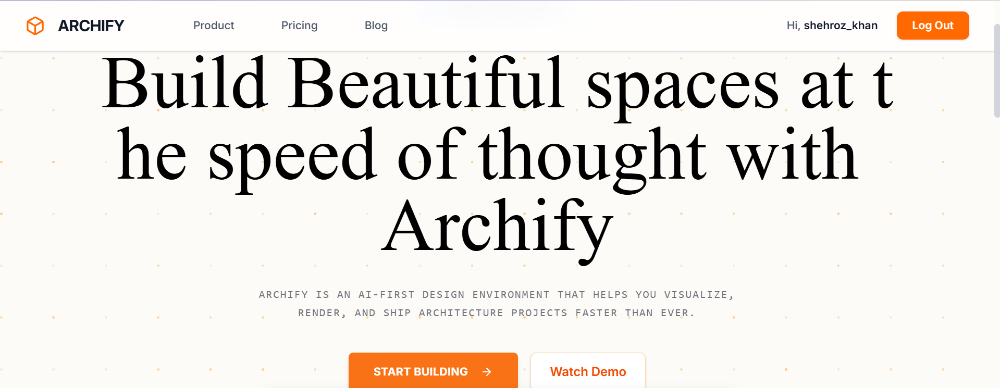
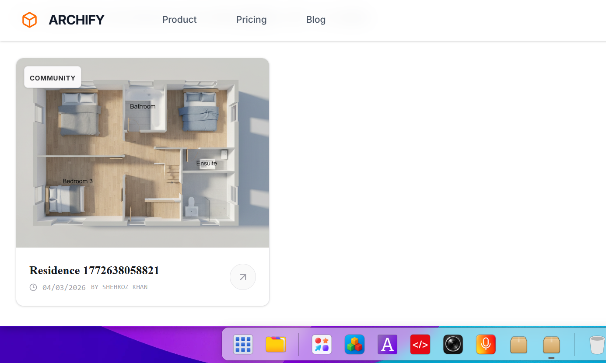
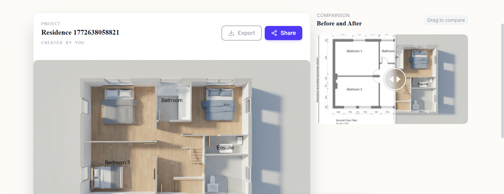

# 🚀 Archify — AI Sketch to 3D Converter

Archify is an AI-powered web application that transforms hand-drawn sketches or printed paper designs into interactive 3D models. It also provides before/after comparisons and allows users to download the generated outputs.

Built for designers, architects, and creators who want to visualize ideas instantly in 3D.

---

## 🌐 Live Demo
https://puter.com/app/archify

---

## 🧠 About the Project

Archify uses AI-based processing to convert 2D sketches into structured 3D representations.

Users can:

- Upload hand-drawn sketches or printed designs
- Convert them into 3D models using AI
- Compare before vs after results
- Download generated images/models

This project bridges the gap between imagination and visualization.

---

## 🛠 Tech Stack

**Frontend**
- React 19
- React Router 7
- Framer Motion

**AI / Processing**
- Puter.js (AI backend integration)
- Image processing logic

**UI / Icons**
- Lucide React
- React Compare Slider

**Build Tools**
- Vite
- TypeScript

---

## ✨ Features

- ✏️ Upload hand-drawn or printed sketches
- 🤖 AI-powered sketch to 3D conversion
- 🔄 Before vs After comparison slider
- 📥 Download generated output
- ⚡ Smooth animations with Framer Motion
- 📱 Fully responsive design
- 🎯 Real-time preview experience

---

## 📸 Screenshots

